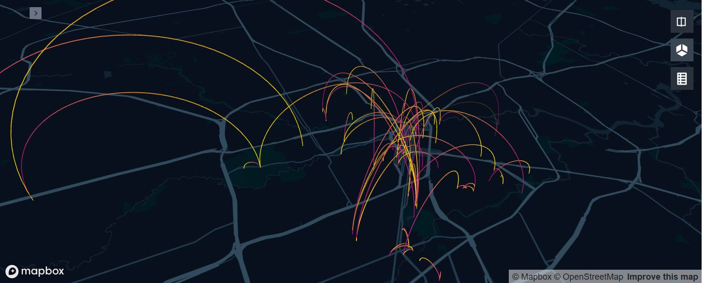

# Data Jam!
This is a project that started at an event put on by the [Houston Data Visualization Meetup Group](https://www.meetup.com/Houston-Data-Visualization-Meetup/). The dataset was provided by Houston BCycle, a bike sharing system. I worked on the data using python and [KeplerGL](kepler.gl), an open source geospatial visualization tool built by Uber.

## Some Notes on Questions to Think About
* Weather - cold and wet way worse than heat?
* How have usage patterns changed over time as stations were added
* Most popular station pairs
* Does use vary by local user zip codes vs visitors from far away zip codes
* are any patterns predictable
* no bikes or one bikes = lost revenue and frustrated customers could be mechanical
* full stations = 0 or 1 dock
* how much does a station being down cost
* usage patterns change by day of week
* fastest someone has ridden
* mininetworks are they islands eg rice, med-center
* super riders vs infrequent riders someone with an annual membership
* repeat single riders that might be better off with a membership 13/mo 79/yr 

# Prompts
    - How does weather - heat, cold, rain, etc. - affect ridership? Are some rider types, stations, areas, more or less affected?
    - How have trip patterns changed as the system has expanded?
    - What are the most popular trip pairs and what do they have in common? Distance, mini network, transit connection, something else?
    - Where do members and users live? How does use of the system compare between locals and visitors: locations, trip types, times distances, etc.?
    - How predictable are patters at individual stations. For example, do some stations always gain or lose bikes during certain time periods?
    - How do usage patterns change by time of day or day of week or season?
    - What's the fastest someone has ridden between stations?
    - When and where will our 1,000,000th trip occur?
    - How self-contained are the mini networks (Rice, UH, TSU, TMC) or how much do people connect to the rest of the network?
    - How do the trip patterns of super users compare to others?
    - Are there people who buy single rides repeatedly and what are their trip patterns?
    - Follow an E-bike around
        - E bike Numbers: 15040, 15050, 15052, 15062, 15074, 15056
    

# Data Description
 8/14 and earlier has these unique fields:
 
    Checkout Dock
    Bike Checkout Method
    Return Dock
    Adjusted Charge

9/14 and after has these unique fields:

    Trip ID
    UserProgramName
    UserRole
    UserCity
    UserState
    UserCountry
    Adjustment Flag
    TripOver30Min
    LocalProgramFlag
    TripRouteCategory
    TripProgramName

And both have the following (using / to indicate fields that are labeled differently, but mean the same thing):

    User ID
    Zip/UserZip
    MembershipType
    Bike
    CheckoutDate/CheckoutDateLocal
    CheckoutTime/CheckoutTimeLocal
    CheckoutKiosk/CheckoutKioskName
    ReturnDate/ReturnDateLocal
    ReturnTime/ReturnTimeLocal-
    ReturnKiosk/ReturnKioskName
    Distance
    EstimatedCarbonOffset
    EstimatedCaloriesBurned
    Duration
    BikeModel/BikeType
    Charge/UsageFee
    AdjustedDuration

